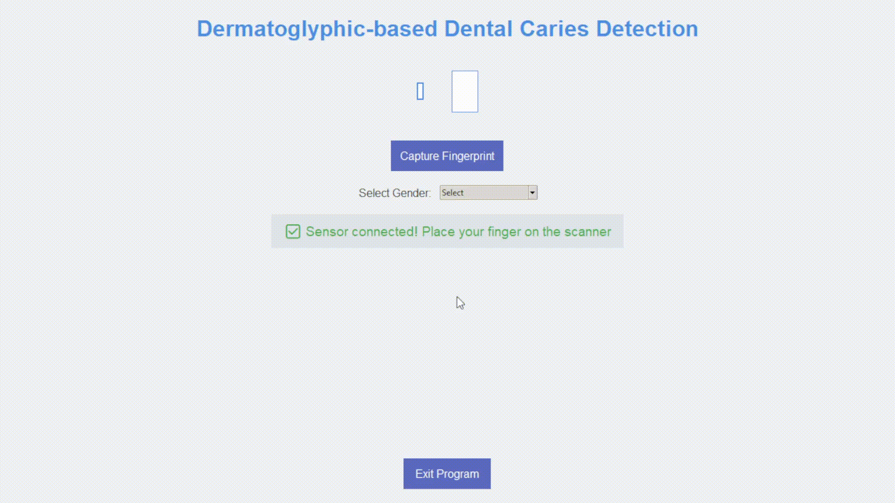

# Dermatoglyphic-based Dental Caries Detection using Deep Learning

This repository contains a non-invasive, deep learning-based system for assessing dental caries risk using fingerprint (dermatoglyphic) analysis. The project combines real-time fingerprint scanning (R307s sensor), ResNet50-based pattern classification, and risk assessment logic trained on the NIST SD4 dataset.

---

## Table of Contents

- [Related Paper](#related-paper)
- [Project Overview](#project-overview)
- [System Workflow](#system-workflow)
- [Demo](#demo)
- [Installation](#installation)
- [Usage](#usage)
- [Prerequisites](#prerequisites)
- [Citation](#citation)

---

## Related Paper

**Title:**  
Integrative Deep Learning for Predictive Dental Caries Assessment: A comprehensive analysis of dermatoglyphic biomarkers

**Authors:**  
Panshul Agarwal, Debarpan Bhattacharya, Dhruv Trivedi, Bilal Ahmed, Abhinav Tomar

**Read the full paper:**  
[Overleaf Link](https://www.overleaf.com/read/gzjnfpkxcjxn#39e715)

---
## Project Overview

Dental caries (tooth decay) is one of the most common chronic diseases worldwide. Recent research highlights a correlation between fingerprint patterns (dermatoglyphics) and susceptibility to dental caries, due to their shared ectodermal origin. This project leverages that correlation, using deep learning to classify fingerprint patterns and predict caries risk, enabling rapid, non-invasive screening.

### Key Features

- Real-time fingerprint acquisition with R307s sensor
- Deep learning-based pattern classification (ResNet50)
- Risk prediction based on fingerprint type and lifestyle factors
- Tkinter-based user interface

---

## System Workflow

1. **Fingerprint Acquisition:**  
   User places a finger on the R307s scanner; the system captures a high-resolution fingerprint image.

2. **Pattern Classification:**  
   The image is processed and classified into one of five dermatoglyphic patterns (Arch, Left Loop, Right Loop, Whorl, Tented Arch) using a ResNet50-based model.

3. **Risk Prediction:**  
   The classified pattern is used to estimate dental caries risk.

4. **Result Output:**  
   The risk score and risk likelihood are displayed in the GUI.

---

## Demo




---

## Installation

1. **Clone the repository:**
git clone https://github.com/yourusername/DentalCariesPrediction.git
cd DentalCariesPrediction


2. **Set up a Python virtual environment (recommended):**
```python -m venv venv```

On Windows:
```venv\Scripts\activate```

On Unix or Mac:
```source venv/bin/activate```


3. **Install dependencies:**
```pip install -r requirements.txt```


If you prefer manual installation:
```pip install opencv-python pyserial pyfingerprint numpy pillow tensorflow```


4. **Connect the R307s fingerprint sensor** to your computer via USB-to-TTL adapter.

---

## Usage

1. **Launch the application:**
```python main.py```


2. **Follow the on-screen instructions:**
- Place your finger on the scanner.
- Enter any additional lifestyle information if prompted.
- View your dental caries risk assessment.

---

## Prerequisites

- **Python 3.8+**
- **Hardware:** R307s fingerprint sensor (with USB-to-TTL serial adapter such as CP2102, etc.)
- **Python libraries:**
  - opencv-python
  - pyserial
  - pyfingerprint
  - numpy
  - pillow
  - tensorflow
  - tkinter (usually included with Python)
- **Model:**  
  - `resNet_model_for_fingerprintClassification.keras` must be present in the project directory.

---

## Citation

If you use this code or ideas in your research, please cite:
> Agarwal, P., Bhattacharya, D., Trivedi, D., Ahmed, B., Tomar, A.  
> "Integrative Deep Learning for Predictive Dental Caries Assessment: A comprehensive analysis of dermatoglyphic biomarkers"
